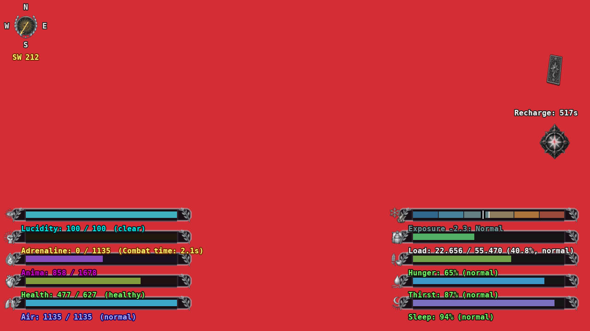
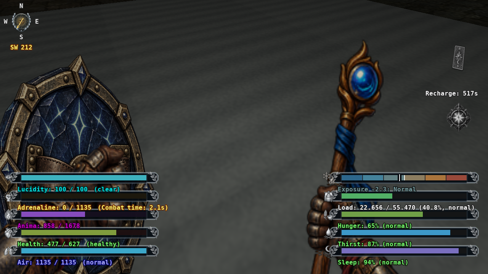

# 5.1.14 / #165 - Damage-flash lifetime across maps

GZDoom 4.14.2, Windows 11, Vulkan. Sequential native runs at 5% audio, unpaused
in the background. The temporary keep-awake request was released with the power
plan unchanged. CA165-01 awaits author acceptance.

## Reproduction and result

The original `loco-map02` checkpoint stores map time 1,759, damage stamp 87,434
and strength 0.032051282. Its position (-6.996,20.728,0) is near the authored
MAP02 entry (0,0); Health is 476/627, Lucidity normal, and the Fool effect expired.
At the observer's tic the old formula yields alpha **152.5534188**, far above
its intended maximum. The native baseline screenshot is entirely red behind
the HUD. This establishes a stale map-local clock, rather than invalid geometry.

Both captures run for the same elapsed time from copies of the original save.
The visible Health increase to 477 is ordinary regeneration, present in both
images. The correction does not heal, damage, move or re-equip the character.

| Native run | Result | Scope |
| --- | --- | --- |
| baseline-final | Reproduced, alpha > 1 | Original renderer and protected checkpoint. |
| regression-final | 14 pass, 0 fail | Legacy visual revision, unchanged gameplay state, valid entry, expired Fool, proportional hits, interpolation, accumulation, cap, expiry and invalid/future timestamps. |
| reload-final | 2 pass, 0 fail | Saved repair remains cleared; no Health loss or position change. |
| travel-airborne | 18 pass, 0 fail | Five map visits, recent flash before four native crossings, paid flight/cooldown retention, airborne MAP01 departure, valid MAP02 arrival and grounded hub return. |

The route is MAP02 -> MAP01 -> MAP02 -> MAP03 -> MAP02. The fixture seeds
paid-effect state without reactivating a card or paying again, then invokes
native ChangeLevel to exercise player travel/PowerFlight lifecycle. It is not
the full narrative doorway dialogue or physical-input acceptance. An earlier
17-check route passed; the retained final fixture adds actual airborne departure.

Visual revision 2 uses an existing saved field: older saved flashes are cleared
once, while a valid current flash survives repeated revision checks. No new save
fields or gameplay migration. Retain the original save/package pair and save
the upgraded game under a new name for reversible rollback. Both original-save
copies remain byte-identical after testing.

## Reproduce

Preserve the author checkpoint at `build/issue165/loco-map02-original.zds`, the
previous package at `baseline/caelum_argenteum_dev.pk3`, and the current package
at `candidate/caelum_argenteum_dev.pk3`. Run `prepare.py` for deterministic
isolated add-ons, then `run_native.ps1` using fresh labels and the package/add-on/
load/script arguments in each `*-run.json`. Load the generated repaired save for
the reload run. Do not overlap GZDoom instances; supply local engine/IWAD paths.

`finalize.py` verifies the retained run labels, packaged source bytes, original
checkpoint hash, fixture determinism and power release. Its private original
record identifies this author's checkpoint, not a general save name. RESULTS.json
contains hashes/counts; STATIC.json records project validation. No saves, PK3,
engine or IWAD are distributed. #158/PR159 and #160/PR161 were accepted and merged
during this task; that acceptance does not include #165.
